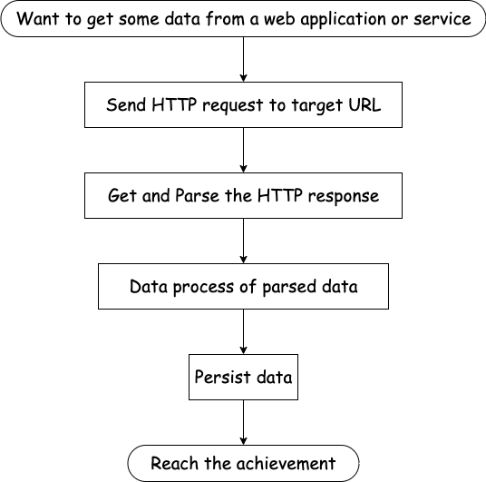
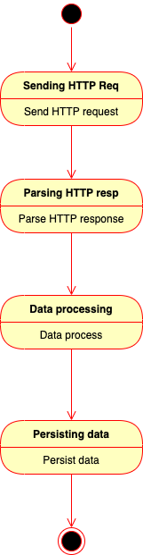
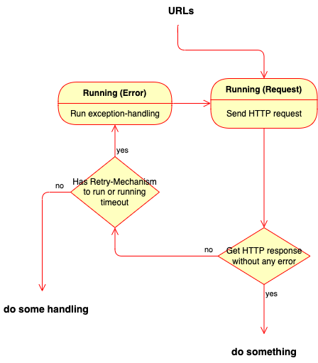
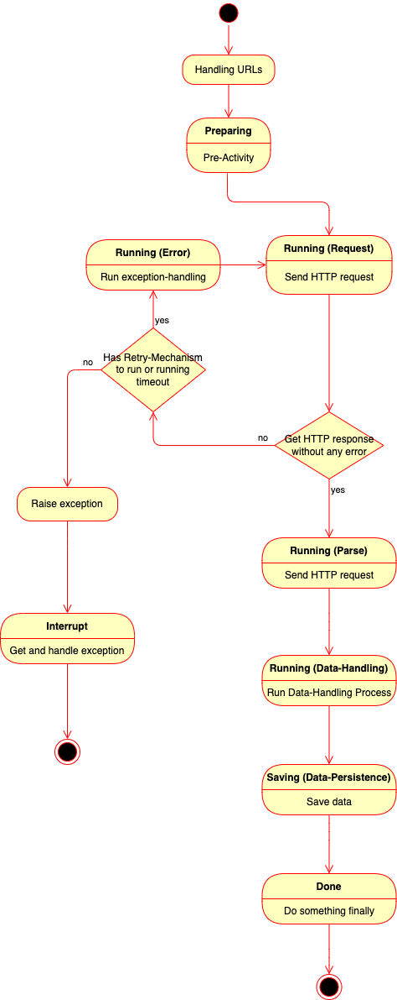
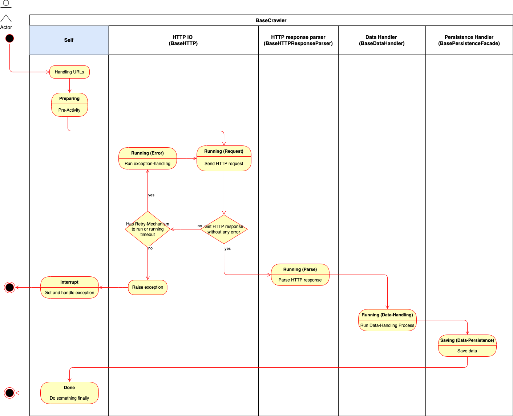

===============
Introduction
===============

About
=======

*SmoothCrawler* is a Python framework for web application crawler. It's core concept
is SoC (Separation of Concerns). In *SmoothCrawler* realm, the major components
of a web spider are:

* Sending HTTP request
* Receive and Parse HTTP response
* Data process of the parsed HTTP response data
* Persistence

Let's draw a simple work flow about it:

|work-flow|

So we clear that what things it would do and the procedure of them, we could try to draw a
activity sequence diagram:

|activity-sequence-diagram-brief|

The state of each processes is still unclear and it's not enough to verify the detail of entire system.
Let's carefully consider about each processes.

* **Sending HTTP request**

What are the problems it may face in process of sending HTTP request? One of them absolutely
is retry mechanism. So it must has a retry mechanism in process of sending HTTP request like
below:

|retry-mechanism-flow|

* **Receive and Parse HTTP response**

Sometimes, it's so complex to process the HTTP response object. Actually, the most parts
of web spider program would be parsing content of HTTP response. So there is another one
object is responsible of parsing process.

* **Data process of the parsed HTTP response data**

It won't be the final data after it parses HTTP response object. It also has an object has
responsibility of processing data.

* **Persistence**

No matter you want to save data as one specific file format or save data into database,
all the implementation and its related process should be in one object to do this.

Finally, from above all info, we could draw a activity sequence diagram with detail:

|activity-sequence-diagram-detail|

.. _different components responsible of different task:

Let's clear them with lanes pool diagram to display the relation between each processes and
objects (classes) with activity sequence diagram:

|lanes-pool-diagram|

Therefore, *SmoothCrawler* has different objects which has their own responsibility
of different concern. Each one object is a component, it could combine different
components to a different crawler object. However, some components could be reused
again and again if it needs for different crawlers. In the other hand, it could freak
easily change one (or more) specific component(s) to other one(s).

.. _About Important:

.. important::

    *SmoothCrawler* provides a software architecture to everyone to follow. In the other
    hand, it MUST TO IMPLEMENT the detail of each components it needs. For example, it
    should implement the sending HTTP request with library *urllib3* or *requests*. And
    for the HTTP response parser, it should implement it with library like *bs4* or something
    else.

    *SmoothCrawler* is a *FRAMEWORK*. And it's ONLY a *FRAMEWORK* without any implementations
    you need.

Comparison
===========

You may ask yourself one question: Do I need *SmoothCrawler* to develop a web spider?
The answer is: absolutely not. To use it or not to use it? Up to you. But the thing you
should more necessary to consider is: what's the problem you may to face in developing
a web spider? Let's demonstrate 2 implementations with old way:

.. code-block:: python

    from bs4 import BeautifulSoup
    import requests

    class ExampleOlderCrawler:

        def main_process(self, url: str) -> requests.Response:
            # Implement all things in a function. It even doesn't has retry mechanism.
            try:
                _response = requests.get(url)
            except Exception as e:
                print("Do something handle error.")
            else:
                _bs = BeautifulSoup(_response.text, "html.parser")
                _example_web_title = _bs.find_all("h1")
                _data = _example_web_title[0].text
                return _data

From above one, you could find that all logics are complexity with each others. It even
doesn't have retry mechanism.

But you may still think: it's okay, I think it's still clear to me. So let's demonstrate
another one:

.. code-block:: python

    import urllib3
    import json

    class StockOlderCrawler:

        def main_process(self, url: str):
            _http = urllib3.PoolManager()
            # _random_sleep = random.randrange(0, 10)
            # time.sleep(_random_sleep)
            try:
                _response = _http.request("GET", url)
            except Exception as e:
                print("Do something handle error.")
            else:
                _data = _response.data.decode("utf-8")
                _result_json = json.loads(_data)
                _result_data = _result_json["data"]

                _final_data = []
                _data_row = []

                for _d in _result_data:
                    # # stock_date
                    _data_row.append(_d[0].replace("/", "-"))
                    # # trade_volume
                    _data_row.append(int(_d[1].replace(",", "")))
                    # # turnover_price
                    _data_row.append(int(_d[2].replace(",", "")))
                    # # opening_price
                    _data_row.append(float(_d[3]))
                    # # highest_price
                    _data_row.append(float(_d[4]))
                    # # lowest_price
                    _data_row.append(float(_d[5]))
                    # # closing_price
                    _data_row.append(float(_d[6]))
                    # # gross_spread
                    _data_row.append(str(_d[7]))
                    # # turnover_volume
                    _data_row.append(int(_d[8].replace(",", "")))

                    _final_data.append(_data_row.copy())
                    _data_row[:] = []

                return _final_data

No matter sending HTTP request, parse the HTTP response and data process. They all are
deeply complexity with each others. If it has more complex data process, the code would
be more dirtier and less unreadable, much less handle other content of HTTP response which
maybe more complex.

Therefore, *SmoothCrawler* resolve the issues with SoC to let web spider could be
more readable, clearer and more easier of software maintainability.

Quickly Demo
=============

For the moment, let's demonstrate one of implementation ways because it's more easier.
If you're very curious, please refer to the topic to get more detail how to use it.

Let's install package and other dependencies you need:

.. code-block:: shell

    pip install smoothcrawler requests bs4

Implement a *SimpleCrawler*:

.. code-block:: python

    from smoothcrawler.crawler import SimpleCrawler
    from bs4 import BeautifulSoup
    import requests

    class ExampleEasyCrawler(SimpleCrawler):

        def send_http_request(self, method: str, url: str, retry: int = 1, *args, **kwargs) -> requests.Response:
            # Implement the sending HTTP request via library 'requests'
            _response = requests.get(url)
            return _response

        def parse_http_response(self, response: requests.Response) -> str:
            # Implement the parsing HTTP response via library 'bs4'
            _bs = BeautifulSoup(response.text, "html.parser")
            _example_web_title = _bs.find_all("h1")
            return _example_web_title[0].text

        def data_process(self, parsed_response: str) -> str:
            # Do nothing in data process
            return parsed_response

Let's run the crawler via function *run*:

.. code-block:: python

   _example_easy_crawler = ExampleEasyCrawler()
   _example_result = _example_easy_crawler.run("get", "http://www.example.com/")
   print(f"Example web crawler result: {_example_result}")
   # Example web crawler result: Example Domain

See? Each functions has their own responsibility, it works clearly and finely. That's
the point of *SmoothCrawler*.

