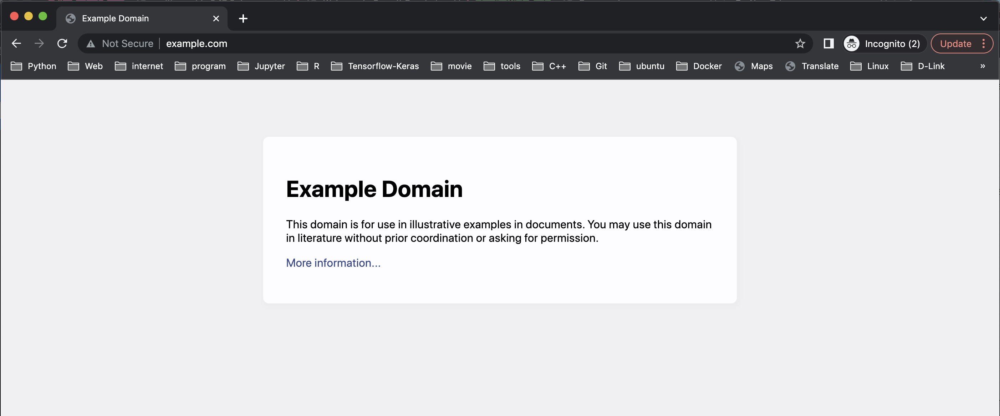
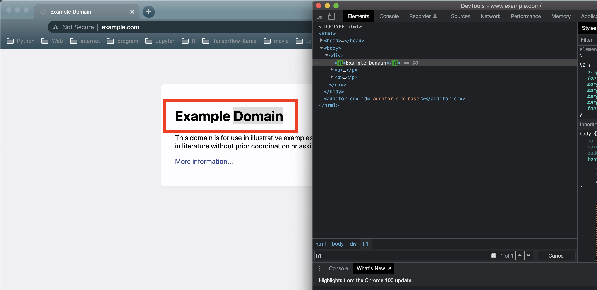

==============
Quickly Start
==============

Before you start to enjoy developing web spider as LEGO, please make sure that you
already has installed *SmoothCrawler* and its some dependencies.

* :ref:`How to install SmoothCrawler?<pip install smoothcrawler>`
* :ref:`What are the dependencies you may need in usage?<Related Dependencies in usage>`

Let's start to have fun with *SmoothCrawler* after you ready!

Create a web crawler (in the same object)
=========================================

If you want to implement a crawler easily, you could extend anyone *BaseCrawler* type
object directly and override some functions of it to finish a web spider.

It doesn't make sense without any demonstration, right? Let's consider a scenario, you
want to get the header (or title) of a website without any data process. For example, get
**Example Domain** from http://www.example.com:

|example-web-page|

Let's start with importing modules we need:

.. code-block:: python

   from smoothcrawler.crawler import SimpleCrawler
   from bs4 import BeautifulSoup
   import requests

*SimpleCrawler* is one of *SmoothCrawler* roles and we could extend its every features
about web spider we need. *bs4* is Python library *BeautifulSoup* which could parse HTML
web content. *requests* is also a Python library which target to handle HTTP request.

Let's open the DevTool of chrome (f12) and find where the HTML element locator is.

|html-element-locator-in-devtool|

It could point the target HTML element with *h1*. However, we need to know which functions
we could extend before build web spider:

* *send_http_request*
Sending HTTP request and return HTTP response.

* *parse_http_response*
Parsing HTTP response and return parsed data.

* *data_process*
Doing data process from parsed data of HTTP response and return handled data.

* *persist*
Persist final result data (as a file format or into database).

From above all, let's extend 3 functions: *send_http_request*, *parse_http_response* and *data_process*.

.. code-block:: python

   class ExampleEasyCrawler(SimpleCrawler):

       def send_http_request(self, method: str, url: str, retry: int = 1, *args, **kwargs) -> requests.Response:
           _response = requests.get(url)
           return _response

       def parse_http_response(self, response: requests.Response) -> str:
           _bs = BeautifulSoup(response.text, "html.parser")
           _example_web_title = _bs.find_all("h1")
           return _example_web_title[0].text

       def data_process(self, parsed_response: str) -> str:
           return parsed_response

After we complete implementations all we need, let's start to run the crawler we done:

.. code-block:: python

   _example_easy_crawler = ExampleEasyCrawler()    # Instantiate your own crawler object
   _example_result = _example_easy_crawler.run("get", Test_Example_URL)    # Run the web spider task with function *run* and get the result
   print(f"Example web crawler result: {_example_result}")
   # Example web crawler result: Example Domain

It works finely and how the code clear and readable is!

Create a web crawler (separate to different objects)
====================================================

content ...

Implement components
-----------------------

content ...

|example-web-page|

|html-element-locator-in-devtool|

**HTTP Sender**
~~~~~~~~~~~~~~~~~

Implement components *HTTP Sender*:

Let's import modules:

.. code-block:: python

    from smoothcrawler.components.httpio import HTTP, AsyncHTTP

content ....

.. code-block:: python

    class Urllib3HTTPRequest(HTTP):

        __Http_Response = None

        def get(self, url: str, *args, **kwargs):
            _http = urllib3.PoolManager()
            # _random_sleep = random.randrange(0, 10)
            # time.sleep(_random_sleep)
            self.__Http_Response = _http.request("GET", url)
            return self.__Http_Response

content ...

.. code-block:: python

    class RequestsHTTPRequest(HTTP):

        __Http_Response = None

        def get(self, url: str, *args, **kwargs):
            # _random_sleep = random.randrange(0, 10)
            # time.sleep(_random_sleep)
            self.__Http_Response = requests.get(url, headers=_HTTP_Header)
            return self.__Http_Response

**HTTP response parser**
~~~~~~~~~~~~~~~~~~~~~~~~~

content ...

Implement component **HTTP response parser**:

.. code-block:: python

    from smoothcrawler.components.data import BaseHTTPResponseParser
    from typing import Any
    from bs4 import BeautifulSoup
    import requests

content ...

.. code-block:: python

    class RequestsExampleHTTPResponseParser(BaseHTTPResponseParser):

        def get_status_code(self, response: requests.Response) -> int:
            return response.status_code

        def handling_200_response(self, response: requests.Response) -> Any:
            _bs = BeautifulSoup(response.text, "html.parser")
            _example_web_title = _bs.find_all("h1")
            return _example_web_title[0].text

**Data Handler**
~~~~~~~~~~~~~~~~~~

content ...

.. code-block:: python

    from smoothcrawler.components.data import BaseDataHandler

content ...

.. code-block:: python

    class ExampleDataHandler(BaseDataHandler):

        def process(self, result):
            return result

content ...

**Persistence**
~~~~~~~~~~~~~~~~~~

content ...

Combines components to a crawler
--------------------------------

content ...

.. code-block:: python

    from smoothcrawler.crawler import SimpleCrawler
    from smoothcrawler.factory import CrawlerFactory

content ...

.. code-block:: python

    self._cf = CrawlerFactory()
    # self._cf.http_factory = Urllib3HTTPRequest(retry_components=MyRetry())
    self._cf.http_factory = RequestsHTTPRequest()
    self._cf.parser_factory = RequestsExampleHTTPResponseParser()
    self._cf.data_handling_factory = ExampleDataHandler()

content ...

.. code-block:: python

    # Crawler Role: Simple Crawler
    sc = SimpleCrawler(factory=self._cf)

    data = sc.run("GET", "http://www.example.com/")
    print(f"[DEBUG] data: {data}")

.. code-block:: python

    # Crawler Role: Simple Crawler
    sc = SimpleCrawler(factory=self._cf)
    sc.register_factory(
        http_req_sender=RequestsHTTPRequest(),
        http_resp_parser=RequestsExampleHTTPResponseParser(),
        data_process=ExampleDataHandler()
    )

    data = sc.run("GET", "http://www.example.com/")
    print(f"[DEBUG] data: {data}")

content ...

Implement different crawler to face different scenario
======================================================

content ...

SimpleCrawler
---------------

content ...

AsyncSimpleCrawler
---------------------

content ...

.. code-block:: python

    from smoothcrawler.crawler import AsyncSimpleCrawler
    from smoothcrawler.urls import URL

content ...

.. code-block:: python

    # Crawler Role: Asynchronous Simple Crawler
    sc = AsyncSimpleCrawler(factory=self._acf, executors=2)

    url = URL(base=Test_Example_URL_With_Option, start="20210801", end="20211001", formatter="yyyymmdd")
    url.set_period(days=31, hours=0, minutes=0, seconds=0)
    target_urls = url.generate()
    print(f"Target URLs: {target_urls}")

    data = sc.run("GET", target_urls)
    print(f"[DEBUG] data: {data}")

ExecutorCrawler
-----------------

content ...

.. code-block:: python

    from smoothcrawler.crawler import RunAsConcurrent, ExecutorCrawler
    from smoothcrawler.urls import URL

content ...

.. code-block:: python

    # Crawler Role: Executor Crawler
    sc = ExecutorCrawler(factory=self._cf, mode=RunAsConcurrent, executors=3)

    url = URL(base=Test_Example_URL_With_Option, start="20210801", end="20211001", formatter="yyyymmdd")
    url.set_period(days=31, hours=0, minutes=0, seconds=0)
    target_urls = url.generate()
    print(f"Target URLs: {target_urls}")

    data = sc.run(method="GET", url=target_urls, lock=False, sema_value=3)
    print(f"[DEBUG] data: {data}")
    for d in data:
        print(f"[DEBUG] pid: {d.pid}")
        print(f"[DEBUG] worker_id: {d.worker_ident}")
        print(f"[DEBUG] state: {d.state}")
        print(f"[DEBUG] exception: {d.exception}")
        print(f"[DEBUG] data: {d.data}")

PoolCrawler
-------------

content ...

.. code-block:: python

    from smoothcrawler.crawler import RunAsParallel, PoolCrawler
    from smoothcrawler.urls import URL

content ...

.. code-block:: python

    # # Crawler Role: Pool Crawler
    with PoolCrawler(factory=self._cf, mode=RunAsParallel, pool_size=5) as pc:
        pc.init(lock=False, sema_value=3)
        data = pc.async_apply(method="GET", urls=[Test_Example_URL_With_Option])
        print(f"[DEBUG] data: {data}")
        for d in data:
            print(f"[DEBUG] data: {d.data}")
            print(f"[DEBUG] is_successful: {d.is_successful}")

content ...

